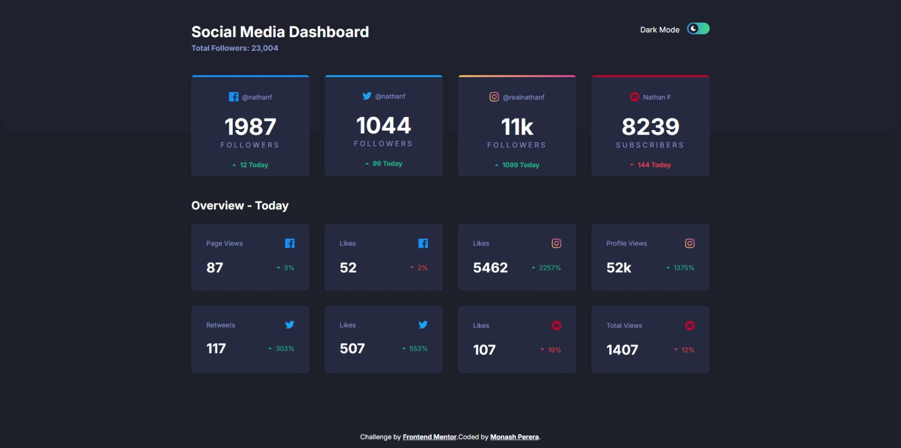
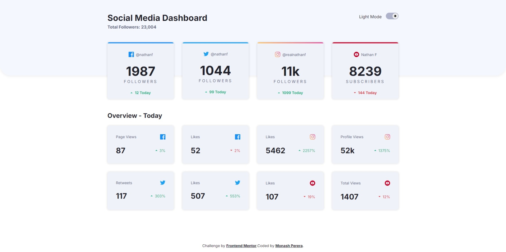
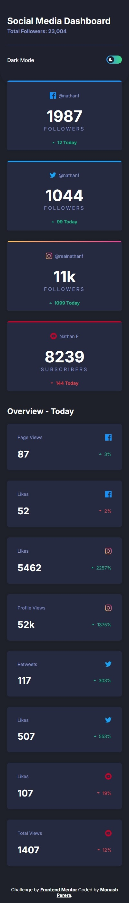
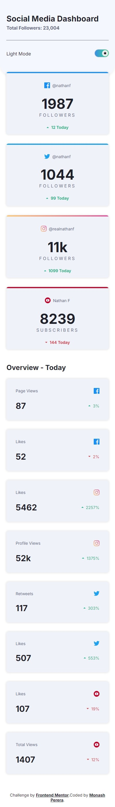

# Frontend Mentor - Social media dashboard with theme switcher solution

This is a solution to the [Social media dashboard with theme switcher challenge on Frontend Mentor](https://www.frontendmentor.io/challenges/social-media-dashboard-with-theme-switcher-6oY8ozp_H). Frontend Mentor challenges help you improve your coding skills by building realistic projects. 

## Table of contents

- [Overview](#overview)
  - [The challenge](#the-challenge)
  - [Screenshot](#screenshot)
  - [Links](#links)
- [My process](#my-process)
  - [Built with](#built-with)
- [Author](#author)
- [Acknowledgments](#acknowledgments)

**Note: Delete this note and update the table of contents based on what sections you keep.**

## Overview

### The challenge

Users should be able to:

- View the optimal layout for the site depending on their device's screen size
- See hover states for all interactive elements on the page
- Toggle color theme to their preference

### Screenshot
Desktop Preview - Dark Mode 

Desktop Preview - Light Mode 

Mobile Preview - Dark Mode 

Mobile Preview - Light Mode 

### Links

- Live Site URL: [https://monashperera.github.io/social-media-dashboard-with-theme-switcher/](https://monashperera.github.io/social-media-dashboard-with-theme-switcher/)

## My process

### Built with

- Semantic HTML5 markup
- CSS custom properties
- Flexbox
- CSS Grid
- Mobile-first workflow
- [React](https://reactjs.org/) - JS library
- [Bootstrap 5](https://getbootstrap.com) - CSS framework

## Author

- Frontend Mentor - [@monashperera](https://www.frontendmentor.io/profile/monashperera)

## Acknowledgments

Thank you frontendmentor 👍👨‍💻.
